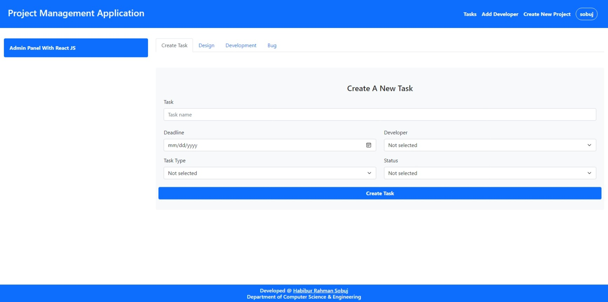

# Project Management Application Frontend

This is the frontend component of the Project Management Application. It is built using React.js to provide a user interface for tracking developer activity and project progress. The frontend focuses on scalability, performance, and user-friendly project visualization.

## Table of Contents

- [Installation](#installation)
- [Features](#features)
- [Screenshot](#screenshot)
- [License](#license)

## Installation

To install and run the frontend of the Project Management Application, follow these steps:

1. Clone the repository to your local machine:

   ```bash
   git clone https://github.com/hr-sobuj/project-management-frontend.git
   ```

2. Navigate to the project directory:

   ```bash
   cd project-management-frontend
   ```

3. Install the required dependencies:

   ```bash
   npm install
   ```

4. Start the development server:

   ```bash
   npm start
   ```

   The frontend server will be accessible at `http://localhost:3000`.

## Features

- **Developer Activity Tracking**: Developers can update project status and log their activity.
- **Project Management**: Managers can create projects, assign developers, and track project progress.
- **Work Reports**: Generate work reports to analyze productivity and project insights.
- **User-friendly Visualization**: Visualize project data and statistics in a clear and intuitive manner.

## Screenshot



This screenshot shows an example of the Project Management Application frontend, displaying the project dashboard and developer activity.

## License

This project is licensed under the [MIT License](LICENSE). Feel free to use and modify the code as per your needs.
